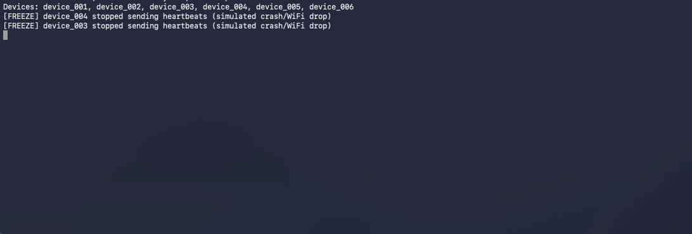

# MQTT Device Watchdog

A **heartbeat-based watchdog** that accurately detects dead IoT devices. MQTT's Last Will Testament (LWT) only triggers on TCP disconnect—devices can fail silently (WiFi drop, freeze without reboot) while the broker still shows them "Online". This system fixes that.

## Problem

- LWT is unreliable: it only fires on TCP disconnect.
- Real failures: WiFi drops but socket stays open, device freezes, power brownout.
- Result: dashboards show "Online" for devices that have been dead for hours.

## Solution

- Each device sends a **heartbeat** every 30 seconds to `devices/{device_id}/heartbeat`.
- The watchdog subscribes to heartbeats, stores last-seen timestamps in **Redis** (fast), and persists status in **PostgreSQL**.
- Every 10 seconds it checks all devices: if no heartbeat for **90 seconds** → device is marked **OFFLINE** and an **alert** is triggered.
- Rich terminal dashboard shows real-time device status.
- Simulated devices **automatically reboot** after 3 minutes of being frozen — demonstrating the full offline → recovery cycle.

## Tech Stack

- **Python 3.11**
- **paho-mqtt** (MQTT client)
- **PostgreSQL** (device status, history, `total_offline_count`)
- **Redis** (fast heartbeat timestamp lookup)
- **Docker Compose** (Mosquitto, Redis, Postgres, watchdog, simulator)
- **pytest** (tests)
- **rich** (terminal table and alerts)

## Project Structure

```
mqtt-device-watchdog/
├── docker-compose.yml
├── Dockerfile
├── requirements.txt
├── .env.example
├── README.md
├── src/
│   ├── broker/
│   │   └── mosquitto.conf
│   ├── simulator/
│   │   └── device_simulator.py   # Simulates IoT devices; some freeze randomly
│   ├── watchdog/
│   │   └── watchdog.py            # Monitors heartbeats, detects dead devices
│   ├── storage/
│   │   ├── database.py            # PostgreSQL: device status, history
│   │   └── heartbeat_store.py    # Redis: heartbeat timestamps
│   └── alerts/
│       └── alert_manager.py      # Console alerts when device goes offline
└── tests/
    └── test_watchdog.py
```

## Demo

### Simulator — Device Freeze & Reboot



### Watchdog — Real-time Dashboard


## Quick Start

1. Copy environment and start everything:

   ```bash
   cp .env.example .env
   # Edit .env if needed (passwords, ports)
   docker-compose up
   ```

2. You will see:
   - **Watchdog**: live table of device status (green/red).
   - **Simulator**: devices sending heartbeats; some will randomly "freeze" (stop sending).
   - When a device misses heartbeats for 90s, it is marked **OFFLINE** and a **red alert panel** is printed.

All services use Docker service names (`mosquitto`, `redis`, `postgres`) and `env_file: .env`.

## Configuration (Environment)

| Variable                                                                              | Description                                    | Default                              |
| ------------------------------------------------------------------------------------- | ---------------------------------------------- | ------------------------------------ |
| `POSTGRES_HOST`, `POSTGRES_PORT`, `POSTGRES_DB`, `POSTGRES_USER`, `POSTGRES_PASSWORD` | PostgreSQL                                     | `postgres`, `5432`, `watchdog`, etc. |
| `MQTT_HOST`, `MQTT_PORT`                                                              | MQTT broker                                    | `mosquitto`, `1883`                  |
| `REDIS_HOST`, `REDIS_PORT`                                                            | Redis                                          | `redis`, `6379`                      |
| `HEARTBEAT_INTERVAL`                                                                  | Device heartbeat interval (seconds)            | `30`                                 |
| `WATCHDOG_CHECK_INTERVAL`                                                             | How often watchdog checks (seconds)            | `10`                                 |
| `HEARTBEAT_TIMEOUT`                                                                   | No heartbeat for this long → offline (seconds) | `90`                                 |
| `SIMULATOR_DEVICE_COUNT`                                                              | Number of simulated devices                    | `10`                                 |
| `SIMULATOR_FREEZE_PROBABILITY`                                                        | Per-tick probability a device freezes          | `0.02`                               |

No hardcoded values; everything is driven by env.

## Running Tests

With PostgreSQL and Redis running (e.g. via `docker-compose up -d postgres redis`), set env to point at them (e.g. `POSTGRES_HOST=localhost`, `REDIS_HOST=localhost`, and host port for Postgres if mapped):

```bash
# From project root, with .env or export POSTGRES_* REDIS_*
pytest tests/ -v
```

Tests use a separate Redis key prefix (`REDIS_HEARTBEAT_PREFIX=test_watchdog:heartbeat:`) so they don't clash with real data.

## License

MIT.
